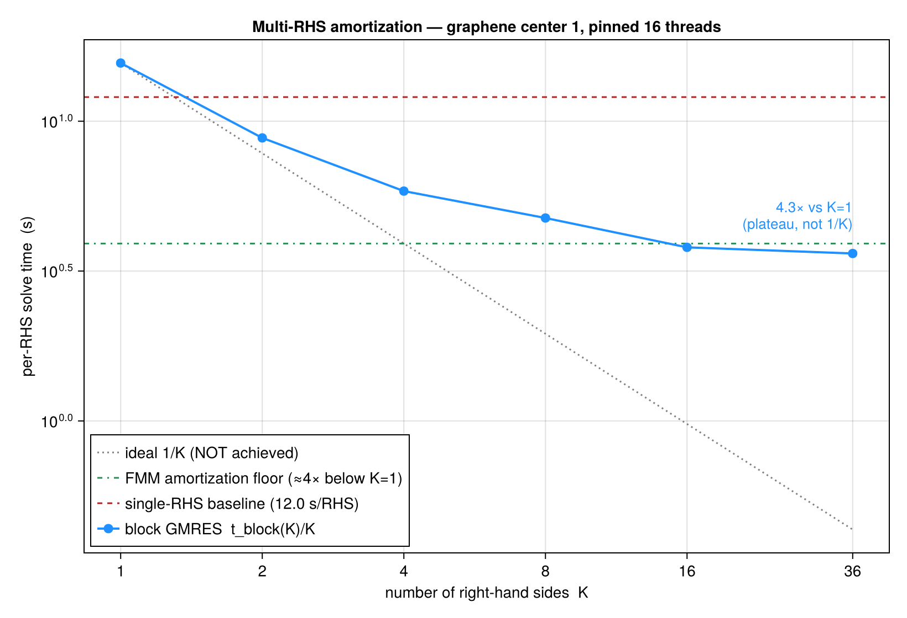

# Multi-RHS Four-Index Integrals in Dielectric Environments — Progress Report

**Branch:** `multi_rhs` · **Date:** 2026-06-03

## 1. Goal

Extend the adaptive boundary-integral solver for screened Coulomb integrals to *larger
systems*: evaluating the four-index integral

$$V_{ijkl} = \iint \rho_{ij}(x_1)\,K(x_1,x_2)\,\rho_{kl}(x_2)\,dx_1\,dx_2
          = \int \rho_{ij}(x)\,\phi_{kl}(x)\,dx$$

for *many* orbital-pair densities $\rho_{ij}=\varphi_i\varphi_j^*$ at once, where $K$ is the
Green's function of the dielectric Poisson problem and
$\phi_{kl}=u_{\mathrm{inc}}[\rho_{kl}]+u[\sigma_{kl}]$ is the screened potential of $\rho_{kl}$.

The key structural fact: the discretized boundary-integral operator $A$ (½γ⁻¹ + Dᵀ) depends
only on the dielectric geometry, **not on the source**. So every pair density is an
independent right-hand side of the *same* linear system $A\sigma = f$. Co-located densities
(those that share a region of space) can therefore be solved together as a block
$A\Sigma = F$ with one shared Krylov space (block GMRES) and one batched fast multipole
evaluation (`lfmm3d` with `nd = K`) per matrix–vector product.

## 2. Pipeline (Steps 0–7)

A run is driven by a single `.bie` text file and proceeds:

0. **Parse** the `.bie`: dielectric box geometry, orbital `.xsf` files, grouping rule, and
   solver parameters.
1. **Pair densities** $\rho_{ij} = \varphi_i\varphi_j$ formed by pointwise product of the two
   Wannier orbitals on their shared `.xsf` grid (each datagrid read once and cached).
2. **Union-support truncation**: a center's $K$ densities are restricted to the grid points
   where the envelope $\sqrt{\sum_k\rho_k^2}$ exceeds `support_rtol × max`, with the *same*
   index set applied to every density so they remain on shared grid points (required for
   batched FMM).
3. **Shared interface**: one dielectric interface is built per center group, dyadically
   refined to resolve the group *envelope* (one FMM/TKM evaluation per refinement depth,
   independent of $K$), plus geometric edge/corner refinement.
4. **Batched RHS** $F = [\,f_1\,\cdots\,f_K\,]$, $f_k = -\partial_{\V n}u_{\mathrm{inc}}[\rho_k]$,
   from one `nd = K` FMM/TKM evaluation.
5. **Block GMRES** solve $A\Sigma = F$ with a custom matrix-capable operator whose matvec
   performs a single `nd = K` batched FMM (plus the sparse near correction and the diagonal
   contrast term).
6. **Layer densities** $\Sigma = [\,\sigma_1\,\cdots\,\sigma_K\,]$.
7. **Four-index matrix** $V_{ab} = \int \rho_a\,(u_{\mathrm{inc}}[\rho_b] + u[\sigma_b])\,dx$:
   the incident potential of the screened source is evaluated by the truncated-kernel method
   (`TKM3D.ltkm3dc`), the scattered layer potential by FMM + adaptive (HCubature) near
   correction (`laplace3d_pottrg_fmm3d_corrected_hcubature`), and both are contracted with the
   raw target density.

## 3. Input format (`.bie`)

```
UNITS bohr
BEGIN_DIELECTRICS
EPS_OUT 1.0
  cx cy cz   Lx Ly Lz   eps        # dielectric boxes, in the .xsf coordinate frame
END_DIELECTRICS
BEGIN_ORBITALS
  id  xsf_path                     # center = |phi|^2 density centroid
  id  xsf_path  cx cy cz           # explicit center override
  id  xsf_path  LATTICE n1 n2 n3   # lattice image: phi translated by n1 a1 + n2 a2 + n3 a3
END_ORBITALS
BEGIN_GROUPING
CUTOFF r                           # center i groups with every j within r; `i : j...` overrides
END_GROUPING
BEGIN_SOLVE
  N_QUAD / EDGE_REFINE_LEVEL|L_EC / RHS_TOL / LHS_TOL / GMRES_RTOL / SUPPORT_RTOL / VOLUME_TOL
END_SOLVE
```

**Off-site densities (`LATTICE`).** A Wannier function in a neighboring cell is an orbital
"image": $\varphi_j(\cdot-\mathbf R)$ with $\mathbf R = n_1\mathbf a_1+n_2\mathbf a_2+n_3\mathbf a_3$.
For a commensurate supercell grid a lattice vector is an integer number of grid steps (verified:
the graphene 5×5 supercell grid has exactly 30 steps per primitive lattice vector), so the
translation is an **exact integer `circshift`** of the density on the same grid — no
interpolation. This lets the off-site pair densities $\rho_{i,j+\mathbf R}=\varphi_i\,
\varphi_j(\cdot-\mathbf R)$ be formed and solved alongside the on-site ones.

**Coordinate frame.** All geometry is in the native `.xsf` frame; orbitals are not translated
to a canonical position. For monolayer graphene the sheet sits at the cell midplane (z = 7.5,
c = 15), so the dielectric slab is simply placed there. (Orbitals whose density wraps a cell
boundary would need periodic unwrapping of the centroid; the production data does not.)

## 4. High-level API

```julia
si  = read_system_input("system.bie")
sol = solve_dielectric_box3d_group(si, center_id)    # Steps 0–6 -> (; sigma, interface, sources, labels, ...)
V   = four_index_matrix(si, sol.interface, sol.sources, sol.sigma)   # Step 7, K×K
res = four_index_integrals("system.bie", center_id)  # one-shot Steps 0–7
```

The whole stack is built on a single `Vector{VolumeSource}` core
(`multi_dielectric_box3d_rhs_adaptive(vss, …)`, `rhs_dielectric_box3d_fmm3d(interface, vss, …)`,
`solve_dielectric_box3d_block(interface, vss; …)`), generalizing the existing single-source
functions to a vector of sources.

## 5. Validation — monolayer graphene

Data: production cRPA Wannier functions (`k_323201_nb_144_c_15`, grid 150×150×192, sheet at
z = 7.5). Dielectric slab L = 90, Lz = 3.35, ε_in = 3.5, ε_out = 1.

**System.** Orbital 1 (sublattice A, `graphene_00001`) and orbital 2 (sublattice B,
`graphene_00002`), each with its 8 surrounding-cell `LATTICE` images. With `CUTOFF 3.0` the
group of center 1 has **K = 12** pair densities (on-site A–A, intra-cell A–B, and A–A / A–B to
the nearest cells). Union-support truncation at `SUPPORT_RTOL = 1e-4` keeps 333,954 of the
4.32 M grid points; the shared interface has 6096 panels (219,456 nodes). Run on a workstation
(96 cores, 1.5 TB RAM).

### 5.1 Block multi-RHS speedup

The 12 densities were solved (i) together by block GMRES and (ii) separately by 12 single-RHS
GMRES solves, on the *same* operator and right-hand sides:

| solve | iterations | wall time |
|---|---|---|
| **block (multi-RHS)** | 8 (shared Krylov) | **45.4 s** |
| separate (12 solves)  | 94 total | 216.7 s |

**Speedup ≈ 4.8×.** Block GMRES converges in 8 block iterations versus 94 total single-RHS
iterations, and each block matrix–vector product is one `nd = 12` batched FMM instead of 12
separate FMM calls.

### 5.2 Four-index integrals (block vs. separate)

The four-index matrix computed from the block layer densities agrees with that from the
separate solves to within the GMRES tolerance. Center-A on-site row $V_{1,b}$:

| pair | $V$ (raw) | meaning |
|---|---|---|
| ρ₁,₁  | 239.5  | on-site A–A (Hubbard U) |
| ρ₁,₂  | 1.68   | intra-cell A–B (nearest neighbor) |
| ρ₁,₃…₈ | 0.26 – 2.79 | A–A to the 8 neighbor cells |
| ρ₁,₁₁…₁₆ | −1.13 … 1.69 | A–B to neighbor cells (sign-changing, since φ_Aφ_B changes sign) |

Per-element relative difference block-vs-separate: ~10⁻⁶–10⁻⁵; full-matrix maximum
4.85 × 10⁻⁴ — i.e. the block result reproduces the independent single-density solves to within
the solve tolerance.

### 5.3 Per-RHS solve-time scaling

To measure the amortization directly, a larger neighbor set was used: center 1 with both
sublattices and their lattice images over two shells ($(n_1,n_2)\in[-2,2]^2$), `CUTOFF 5.0` →
**K = 36** pair densities (union support 611,588 points; one fixed interface of 6096 panels /
219,456 nodes). On that *fixed* interface/operator/RHS, the K nearest densities were block-solved
for K = 1,2,4,8,16,36. **Only the GMRES solve is timed** — the one-time interface refinement,
neighbor-list/corrections build, and RHS assembly are excluded (they are shared by all K and by
both the block and single-RHS paths).

The solve cost was instrumented per step (FMM / near-correction matmul / dense glue / GMRES
overhead) with **`OMP_NUM_THREADS` pinned** so every K runs at the *same* thread count
(`../bench_solve_breakdown.jl`, `fmm_tol = 1e-4`):

| OMP | K | iter | nmv | total (s) | FMM | matmul | glue | GMRES | per-RHS (s) |
|---:|---:|---:|---:|---:|---:|---:|---:|---:|---:|
| 1  | 1  | 7 | 7 | 61.4  | 57.9 (94%) | 0.02 | 0.70 | 2.83 | 61.4 |
| 1  | 36 | 7 | 7 | 552.6 | 537.4 (97%) | 0.23 | 12.7 | 2.25 | **15.3** |
| 16 | 1  | 7 | 7 | 11.6  | 8.1 (70%)  | 0.01 | 0.65 | 2.85 | 11.6 |
| 16 | 36 | 7 | 7 | 91.6  | 77.6 (85%) | 0.23 | 12.7 | 1.06 | **2.54** |

**Per-RHS amortization (K=1 → K=36) is ~4×: 4.0× at omp=1, 4.5× at omp=16** — and it *tracks the
FMM*. Two facts pin the mechanism down:

- **`nmv` = 7 for K=1 and K=36 alike.** Block GMRES applies the operator the same number of times
  regardless of K; it does **not** save iterations. The amortization comes **entirely from the
  batched FMM** — one `nd = K` `lfmm3d` per matvec, tree built once: `nd=36` costs ~9.3× `nd=1`,
  i.e. ~3.9× per RHS. Since the FMM is **94–97 %** of the solve (matmul negligible, glue 2–14 %,
  GMRES a fixed ~1–3 s), the whole solve inherits the FMM's ~4×.
- This is the *same* ~4× ceiling as the bare FMM kernel: ~80–84 % of one `lfmm3d` call is
  per-interaction geometry/operator work — the `1/r` distance factors (P2P), the Legendre
  recurrences (P2M/L2P), and the M2L translation operators — which FMM3D computes once and reuses
  across all K densities (the `do idim=1,nd` inner loop in every kernel); only the per-density
  coefficient arithmetic scales with K. (Tree construction is ~2 %, *not* the shared cost — the
  earlier "tree-build ~75 %" framing was wrong; see `performance_findings.md` §1 for the measured
  per-phase breakdown.)



> **Correction.** An earlier *unpinned* run of `bench_per_rhs.jl` reported a per-RHS speedup of
> ~18× tracking the ideal $1/K$ line, and attributed it to "fewer iterations." That was a
> **thread-count artifact**: with `OMP_NUM_THREADS` unset, the small-K solves ran effectively
> single-threaded while the large-K solves picked up OpenBLAS/FMM threads — so it folded a ~4×
> thread speedup into the K axis. The arithmetic is decisive: at `omp=1` the K=36 FMM *alone* is
> 537 s, so the 127 s total that run reported for K=36 is impossible single-threaded. With threads
> pinned, the honest amortization is ~4× (above), `iter = nmv = 7` for all K, and block GMRES does
> not reduce the matvec count — its sole benefit is the batched FMM. *(Data:
> `../bench_solve_breakdown.jl` (`../data/solve_breakdown.csv`) and pinned
> `../bench_per_rhs.jl`; 96-core / 1.5 TB genoa node.)*

## 6. Implementation notes / performance

- **Refinement scales with the group envelope, not K.** Refining one rss-envelope source
  (one FMM/TKM per dyadic depth) replaced per-source refinement (K evaluations per depth),
  which was the dominant cost — and a memory crash — for large groups.
- **Truncation is relative to the global envelope max.** A per-source-relative threshold was
  tried but blows up: a weakly-overlapping far pair has a tiny, broad density, so "1e-4 of its
  own peak" sits near the noise floor and keeps almost the whole grid. The global-envelope
  criterion keeps the support of significant pairs and few points for weak ones.
- **Evaluation cost.** The scattered-potential step refines the interface once for *all*
  targets jointly (a panel is split if near any target) and is dominated by the number of near
  (target, panel) HCubature pairs; it scales with the target-point count, so `support_rtol`
  controls its cost.

## 7. Status and next steps

The full `.bie → V_{ijkl}` pipeline runs end-to-end on real graphene data, including off-site
densities via lattice images, with a ~4.8× block-solve speedup and block/separate agreement to
solve tolerance. Possible next steps: convert raw $V$ to eV and benchmark against the cRPA
reference $U_{ijkl}$; assemble the full $V_{ijkl}$ across centers; and study larger cutoffs /
more orbitals.
